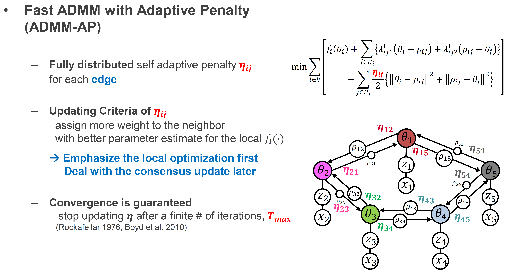
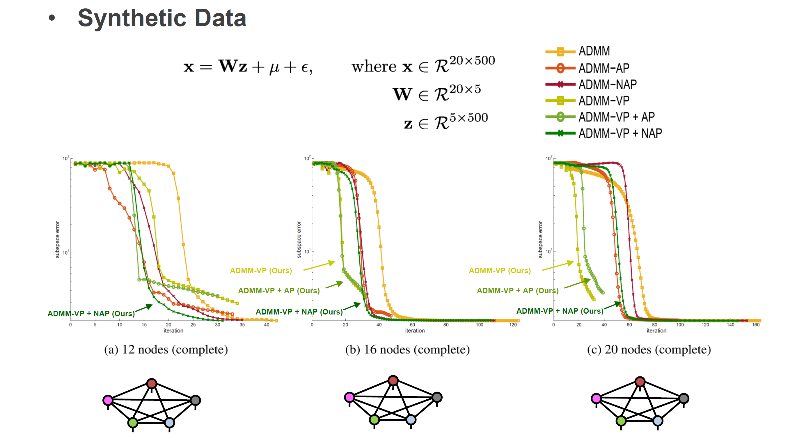
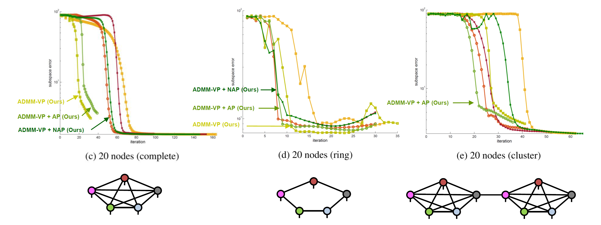
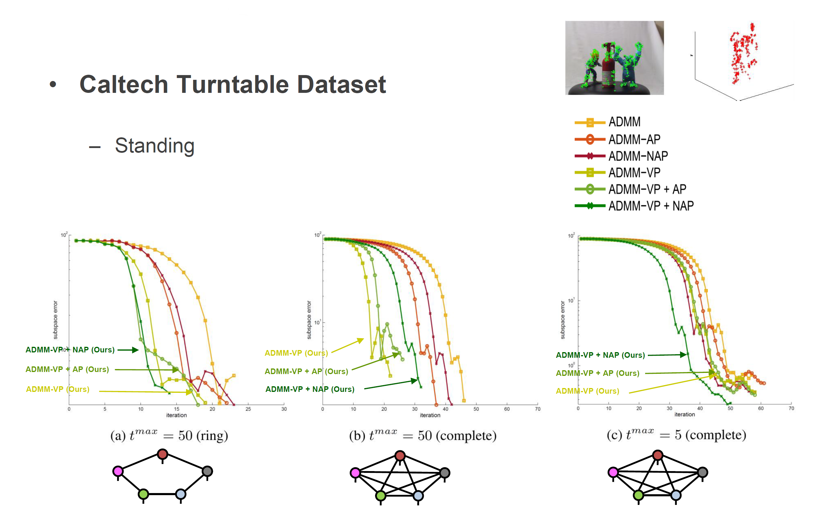

# Fast ADMM Algorithm for Distributed Optimization with Adaptive Penalty

Changkyu Song, Sejong Yoon and Vladimir Pavlovic, Fast ADMM Algorithm for Distributed Optimization with Adaptive Penalty, The 30th AAAI Conference on Artificial Intelligence (AAAI 2016), Phoenix, Arizona, USA, 2016. [[PDF]](https://arxiv.org/abs/1506.08928) [[Project Page]](https://sites.google.com/site/changkyusong86/research/aaai2016)

We propose new methods to speed up convergence of the Alternating DirectionMethod of Multipliers (ADMM), a common optimization tool in the context oflarge scale and distributed learning.  The proposed method accelerates the speedof convergence by automatically deciding the constraint penalty needed for pa-rameter consensus in each iteration.  In addition,  we also propose an extensionof the method that adaptively determines the maximum number of iterations toupdate the penalty.  We show that this approach effectively leads to an adaptive,dynamic network topology underlying the distributed optimization. The utility ofthe new penalty update schemes is demonstrated on both synthetic and real data,including a computer vision application of distributed structure from motion.

# Overview

# Results

# Author

[Changkyu Song](https://sites.google.com/site/changkyusong86) (changkyusong86@gmail.com)
